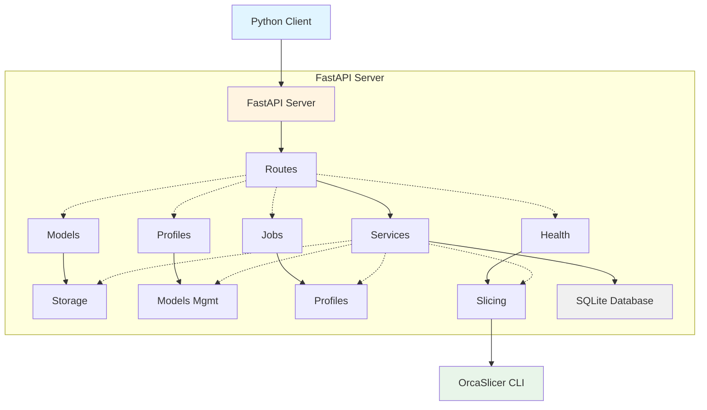

# OrcaSlicer API

A production-ready HTTP API wrapper around OrcaSlicer for programmatic 3D model slicing. This project provides a RESTful API server with a Python client library, designed for headless operation in containerized environments.

## 🎯 Features

- **HTTP REST API** - Clean, well-documented API with OpenAPI/Swagger support
- **OrcaSlicer Integration** - Wraps OrcaSlicer CLI for headless slicing
- **Multiple Input Formats** - Support for `.stl`, `.step`, and `.3mf` files
- **Profile Management** - Create, manage, and override slicing profiles
- **Flexible Outputs** - Generate G-code, 3MF projects, and detailed metadata
- **Python Client** - High-level client library for easy integration
- **Docker-First** - Container-only deployment with Docker Compose support
- **Async Processing** - Background job processing with status polling
- **Production Ready** - Structured logging, error handling, health checks

## 🏗️ Architecture



### Tech Stack

- **Language**: Python 3.11+
- **Framework**: FastAPI
- **Server**: Uvicorn (ASGI)
- **Database**: SQLite + SQLAlchemy
- **Validation**: Pydantic
- **Slicer**: OrcaSlicer CLI (AppImage)

## 🚀 Quick Start

### Prerequisites

- Docker 20.10+
- Docker Compose 2.0+

### Build and Run

1. **Clone the repository**

```bash
git clone https://github.com/yourusername/orcaslicer-api.git
cd orcaslicer-api
```

2. **Build the Docker image**

```bash
docker build -t orcaslicer-api .
```

3. **Run with Docker Compose**

```bash
docker-compose up -d
```

4. **Verify the service**

```bash
curl http://localhost:8000/health
```

### Access the API

- **API Base**: http://localhost:8000
- **Swagger UI**: http://localhost:8000/docs
- **ReDoc**: http://localhost:8000/redoc
- **OpenAPI Schema**: http://localhost:8000/openapi.json

## 📖 API Usage

### Workflow Example

The typical workflow involves:

1. **Upload a model**
2. **Create or select a profile**
3. **Create a slice job**
4. **Poll for job completion**
5. **Download outputs** (G-code, 3MF, metadata)

### Upload a Model

```bash
curl -X POST http://localhost:8000/models \
  -F "file=@bracket.stl"
```

Response:
```json
{
  "id": "mdl_3q9x7r",
  "filename": "bracket.stl",
  "format": "stl",
  "size_bytes": 1048576,
  "uploaded_at": "2025-11-23T10:00:00Z",
  "checksum_sha256": "c9c60579...",
  "storage_path": "/data/models/mdl_3q9x7r/bracket.stl"
}
```

### Create a Profile

```bash
curl -X POST http://localhost:8000/profiles \
  -H "Content-Type: application/json" \
  -d '{
    "name": "LargeRobot_PLA_0.2mm",
    "description": "Profile for large manipulator",
    "source": "user",
    "vendor": "Ginger Additive",
    "machine_id": "ginger_large_manipulator",
    "process_id": "0.20mm Quality @Ginger",
    "filament_id": "Ginger PLA White",
    "settings_overrides": {
      "layer_height": 0.2,
      "infill_density": 25,
      "support_enable": true
    }
  }'
```

### Create a Slice Job

```bash
curl -X POST http://localhost:8000/slice-jobs \
  -H "Content-Type: application/json" \
  -d '{
    "model_id": "mdl_3q9x7r",
    "profile_id": "prof_large_robot_pla_0_2",
    "overrides": {
      "layer_height": 0.16,
      "infill_density": 40
    },
    "output_options": {
      "gcode": true,
      "project_3mf": true,
      "metadata_json": true
    }
  }'
```

### Check Job Status

```bash
curl http://localhost:8000/slice-jobs/job_9k2z1v
```

Response (completed):
```json
{
  "id": "job_9k2z1v",
  "model_id": "mdl_3q9x7r",
  "profile_id": "prof_large_robot_pla_0_2",
  "status": "completed",
  "queued_at": "2025-11-23T11:10:00Z",
  "started_at": "2025-11-23T11:11:05Z",
  "finished_at": "2025-11-23T11:12:40Z",
  "output": {
    "gcode_url": "http://localhost:8000/files/job_9k2z1v/output.gcode",
    "project_3mf_url": "http://localhost:8000/files/job_9k2z1v/project.3mf",
    "metadata": {
      "estimated_print_time_seconds": 5400,
      "filament_used_mm": 13456.7,
      "filament_used_g": 39.2,
      "layer_count": 260,
      "bounding_box_mm": {
        "x": 120.0,
        "y": 80.0,
        "z": 35.0
      }
    }
  }
}
```

### Download G-code

```bash
curl http://localhost:8000/slice-jobs/job_9k2z1v/gcode \
  -o output.gcode
```

## 🐍 Python Client

The included Python client provides a high-level interface to the API.

### Installation

The client is included in the repository at `src/clients/python_client.py`. You can copy it to your project or install the entire package.

### Usage Example

```python
from src.clients.python_client import OrcaSlicerClient
import time

# Initialize client
client = OrcaSlicerClient(base_url="http://localhost:8000")

# Upload model
model = client.upload_model("example.stl")
print(f"Uploaded model: {model['id']}")

# Create profile
profile = client.create_profile({
    "name": "MyProfile",
    "vendor": "Ginger Additive",
    "machine_id": "ginger_large",
    "process_id": "0.2mm Quality",
    "filament_id": "PLA White",
    "settings_overrides": {
        "layer_height": 0.2,
        "infill_density": 25
    }
})
print(f"Created profile: {profile['id']}")

# Create slice job
job = client.create_slice_job(
    model_id=model["id"],
    profile_id=profile["id"],
    overrides={"infill_density": 30},
    output_options={
        "gcode": True,
        "project_3mf": True,
        "metadata_json": True
    }
)
print(f"Created job: {job['id']}")

# Poll for completion
while True:
    job = client.get_slice_job(job["id"])
    print(f"Job status: {job['status']}")

    if job["status"] == "completed":
        print("✓ Slicing completed!")
        break
    elif job["status"] == "failed":
        print(f"✗ Slicing failed: {job.get('error_message')}")
        break

    time.sleep(2)

# Download outputs
if job["status"] == "completed":
    client.download_gcode(job["id"], "output.gcode")
    client.download_project_3mf(job["id"], "project.3mf")
    print(f"Downloaded outputs")
    print(f"Estimated print time: {job['output']['metadata']['estimated_print_time_seconds']}s")
```

### Error Handling

```python
from src.clients.python_client import OrcaSlicerClient, ApiError

client = OrcaSlicerClient(base_url="http://localhost:8000")

try:
    profile = client.get_profile("nonexistent_id")
except ApiError as e:
    print(f"Error {e.error_code}: {e.message}")
    print(f"HTTP Status: {e.status_code}")
    print(f"Details: {e.details}")
```

## 📋 API Endpoints

### Models

- `POST /models` - Upload a model
- `GET /models` - List models
- `GET /models/{model_id}` - Get model details

### Profiles

- `POST /profiles` - Create profile
- `GET /profiles` - List profiles
- `GET /profiles/{profile_id}` - Get profile details
- `PATCH /profiles/{profile_id}` - Update profile
- `DELETE /profiles/{profile_id}` - Delete profile

### Slice Jobs

- `POST /slice-jobs` - Create slice job
- `GET /slice-jobs/{job_id}` - Get job status
- `GET /slice-jobs/{job_id}/gcode` - Download G-code
- `GET /slice-jobs/{job_id}/project.3mf` - Download 3MF project

### Health

- `GET /health` - Service health check

## ⚙️ Configuration

Configuration is done via environment variables:

| Variable | Description | Default |
|----------|-------------|---------|
| `ORCA_CLI_PATH` | Path to OrcaSlicer CLI | `/app/squashfs-root/AppRun` |
| `ORCA_DATADIR` | OrcaSlicer config directory | `/app/orca-config` |
| `DATA_DIR` | Persistent data directory | `/data` |
| `LOG_LEVEL` | Logging level | `INFO` |
| `LOG_JSON` | JSON-formatted logs | `true` |

## 🔧 Development

### Local Development (without Docker)

1. **Install dependencies**

```bash
python3.11 -m venv venv
source venv/bin/activate
pip install -r requirements.txt
```

2. **Set environment variables**

```bash
export ORCA_CLI_PATH=/path/to/orcaslicer
export DATA_DIR=./data
export LOG_JSON=false
```

3. **Run the server**

```bash
python -m uvicorn src.main:app --reload
```

### Project Structure

```
orcaslicer-api/
├── src/
│   ├── api/                 # API route handlers
│   │   ├── routes_models.py
│   │   ├── routes_profiles.py
│   │   ├── routes_slice_jobs.py
│   │   └── routes_health.py
│   ├── core/                # Core utilities
│   │   ├── config.py
│   │   ├── logging.py
│   │   └── errors.py
│   ├── models/              # Data models
│   │   ├── db_models.py     # SQLAlchemy models
│   │   └── schemas.py       # Pydantic schemas
│   ├── services/            # Business logic
│   │   ├── models_service.py
│   │   ├── profiles_service.py
│   │   ├── slice_service.py
│   │   └── storage_service.py
│   ├── clients/             # Client libraries
│   │   └── python_client.py
│   ├── database.py          # Database setup
│   └── main.py              # FastAPI app
├── Dockerfile
├── docker-compose.yml
├── requirements.txt
├── README.md
└── LICENSE
```

## 🎓 Use Case: Large-Scale Additive Manufacturing

This API was designed for programmatic slicing in large-scale additive manufacturing scenarios. For example:

- **Automated pricing systems** that need to estimate print time and material costs
- **Web-based slicing services** that generate G-code on demand
- **Manufacturing pipelines** that process batches of models
- **Custom machine profiles** for non-standard 3D printers or manipulators

The profile system allows you to define custom machine configurations (like a large robotic manipulator) alongside standard desktop printer profiles.

## 🤝 Contributing

Contributions are welcome! This project follows standard Python development practices:

- Code style: PEP 8
- Type hints encouraged
- Docstrings for public APIs
- Async/await for I/O operations

## 📄 License

This project is licensed under the MIT License - see the [LICENSE](LICENSE) file for details.

## 🔗 Related Projects

- [OrcaSlicer](https://github.com/SoftFever/OrcaSlicer) - The amazing open-source 3D printer slicer
- [FastAPI](https://fastapi.tiangolo.com/) - Modern, fast web framework for building APIs

## 📞 Support

For issues, questions, or contributions, please open an issue on GitHub.

---

**Note**: This is an unofficial wrapper around OrcaSlicer. Please refer to OrcaSlicer's own documentation for details about slicing parameters, machine profiles, and capabilities.
